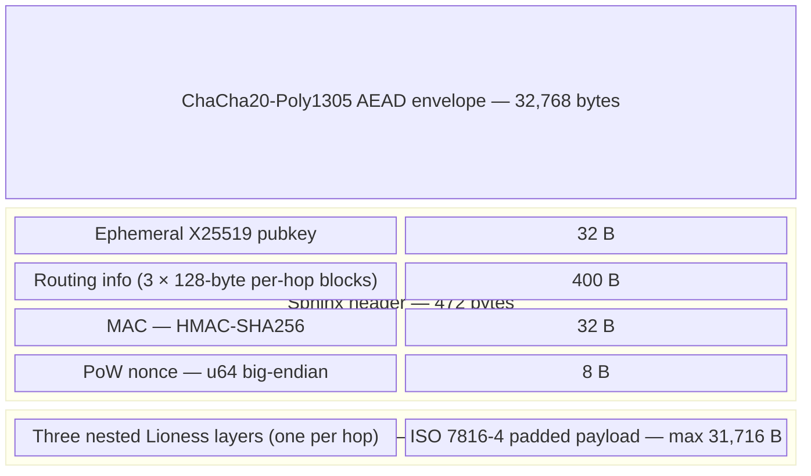

# Nox Protocol

This page covers the protocol-level specification for Nox: packet format, cryptography, mixing, cover traffic, reply paths, error correction, and on-chain components. For SDK-level usage (how to route transactions and RPC calls through Nox in your application), see [Architecture](/architecture).

## Design basis

Nox is a three-hop stratified Sphinx mixnet following the Loopix design (USENIX Security 2017). Ten nodes are live on Arbitrum Sepolia. The mixnet has two roles in the Hisoka system:

1. **Query transport.** Every RPC and HTTP read from the browser wallet routes through Nox so no provider links the requesting IP to the query.
2. **Anonymous paymaster.** The `gas_payment` Noir circuit proves a user holds shielded funds to cover a relayer's gas cost. The exit node submits the transaction via `RelayerMulticall`. No `msg.sender` check exists; the ZK proof is the authorization.

## Network topology

Three layers: **entry** (HTTP ingress, PoW check, rate limiting) → **relay** (Poisson mixing, libp2p forwarding) → **exit** (final decrypt, Ethereum dispatch).

Layer assignment is deterministic: `layer(addr) = SHA256(lowercase(addr))[0] mod 3`. Every client and node computes the same assignment from the on-chain registry with no coordination. This means the layer assignment is predictable by a well-resourced adversary; epoch-based VRF assignment is future work.

The client builds the full onion locally and sends to the entry node ("thick client"). The entry node never sees a plaintext form of the request.

Full-path compromise probability: **f³** where f is the fraction of adversary-controlled nodes. At f=0.2, this is 0.008.

## Sphinx packet format

Every packet is exactly **32,768 bytes**. Fixed size means an observer cannot distinguish a small RPC call from a large transaction.



The outer ChaCha20-Poly1305 envelope protects the packet in transit to the entry node. Inside, the Sphinx header is the onion routing layer; the body carries the actual payload encrypted under three nested Lioness wide-block ciphers (one per hop).

### Per-hop routing blocks

Each of the three 128-byte per-hop blocks contains: `flag(1)` (0x00 Forward / 0x01 Exit) ‖ `addr_len(1)` ‖ `next-MAC(32)` ‖ next-hop libp2p multiaddr (UTF-8). Consumed bytes are replaced by ChaCha20 keystream filler to keep the routing block at a constant 400 bytes at every hop.

## Per-hop processing

Each node applies six operations in order:

1. **ECDH:** `s = X25519(node_sk, pk_eph)`
2. **Subkey derivation:** domain-separated SHA-256 of `label ‖ s` for labels `"rho"` (routing), `"mu"` (MAC), `"pi"` (body), `"blind"` (key blinding)
3. **MAC verify:** `HMAC-SHA256(μ, routing_info) == header.mac`: constant-time comparison; reject before any decryption on failure
4. **Routing decrypt:** ChaCha20 with key ρ and zero IV (safe because ρ is unique per hop)
5. **Body decrypt:** `Lioness⁻¹(π, body)`: removes this hop's encryption layer
6. **Key blinding (Forward only):** `pk_eph' = blind · pk_eph`: Montgomery scalar multiplication on the ephemeral key so adjacent hops see different public keys, breaking DDH linkage across hops

## Lioness body cipher

The original Sphinx specification used a stream cipher for the body, which admits a single-bit tagging attack: an observer can flip a bit in the body at one hop and detect whether the same flipped bit appears at the next hop, linking the two observations.

Nox replaces the stream cipher with **Lioness**, a 4-round Luby-Rackoff wide-block cipher instantiated with ChaCha20 (stream rounds) and SHA-256 (hash rounds). A single-bit flip in the body at any point diffuses over the entire 32 KB body by the end of the four rounds, making the tagging attack infeasible.

Lioness split: R = first 32 bytes, L = remainder (~32,264 bytes). Round order uses subkey indices **(k₂, k₁, k₄, k₃)** with stream rounds operating on the larger half:

```
L ^= ChaCha20(SHA256(k2 ‖ R))
R ^= SHA256(k1 ‖ L)
L ^= ChaCha20(SHA256(k4 ‖ R))
R ^= SHA256(k3 ‖ L)
```

Subkeys k1–k4 are derived via HKDF-SHA256 from the body subkey π with info strings `"lioness_k1"` through `"lioness_k4"`. Keys zeroize on drop. Lioness is not self-inverse: SURB recovery calls `lioness_encrypt` (not `lioness_decrypt`) to undo the relays' decrypt operations.

## Poisson mixing

Each relay node delays packets by a random duration sampled from an exponential distribution with rate λ. This Poisson delay is memoryless: the output timing distribution is independent of input timing. Under the M/M/∞ queueing model, the number of packets in the mix at any time is approximately Poisson(Λ/μ), and the exit ordering is asymptotically uniform over all n! orderings.

Mixing parameters (three sources, which differ):

| Source | `mix_delay_ms` | `min_pow_difficulty` |
|---|---|---|
| Build default | 500 | 3 |
| `run-nox` config templates | 200 | 3 |
| Live testnet nodes (10 nodes, operational record) | 50 | 1 |

The SDK runs with SURB PoW = 0. These discrepancies are real; rely on the operational record for the live network and the config templates for self-hosted deployments.

## Cover traffic

Nox implements Loopix's cover traffic classes. (The original Hisoka spec said three classes; Loopix defines four.)

| Class | Direction | Default rate | Testnet rate | Purpose |
|---|---|---|---|---|
| Loop (λ_L) | Node → full network → self | 0.05/s | 0.02/s | Path health probe |
| Drop (λ_D) | Node → random exit → discarded | 0.05/s | 0.02/s | Dummy traffic injection |
| Client payload cover (λ_P) | Client → network | Supported | Off by default | Masks real client traffic |
| Mix loop (λ_M) | Mix → mix | Config | Config | Mix node health |

Cover and read-only traffic is **free**. Only state-changing writes (transactions submitted by exit nodes) incur fees. Free cover traffic maximizes the anonymity set: every dummy packet is a real packet to a network observer.

## Replay protection

Before any cryptographic operation, each node checks whether a packet has been seen before. The replay tag is `BLAKE3(pk_eph ‖ header.mac ‖ nonce.to_le_bytes())`.

The tag is checked in a **rotational dual-Bloom filter**: a "current" filter (written) and a "previous" filter (read-only), both queried on ingress. Configuration: 100,000 entries per filter, false-positive rate 0.001, rotation interval 3,600 seconds. The filter state is persisted to disk on rotation and restored on restart if downtime is at most 2× the rotation interval.

The 0.1% false-positive rate means roughly 1 in 1,000 legitimate packets is rejected as a replay. Reed-Solomon FEC on the reply path absorbs these losses.

## Proof of work

Each packet must satisfy a PoW challenge before the node performs any elliptic curve operations:

```
leading_zeros(SHA-256(pk_eph ‖ routing ‖ mac ‖ nonce_be)) ≥ d_pow
```

Default: `d_pow = 3 bits` (~8 hashes expected). Maximum: 64 bits. An optional BLAKE3 variant runs roughly 3× faster for high-difficulty settings. The solver uses parallel threads (rayon) for difficulty above 8 bits.

PoW is checked in the ingest stage, before EC operations. This raises the cost of spam and DoS without requiring state or coordination.

## SURBs (Single-Use Reply Blocks)

The exit node knows the request but not the requester. To reply, the client includes **SURBs** with each outgoing packet.

A SURB is a pre-built encrypted return path: `{id[16], header(472B), first_hop, payload_keys}`. The client stores a `SurbRecovery` entry: `{id, layer_keys[per_hop], payload_keys}`. Both structures zeroize on drop.

The exit node attaches the response payload to a SURB and sends it back through the network. Each relay on the return path calls `lioness_encrypt` (not decrypt) to undo its own `lioness_decrypt`: because SURB recovery reverses the operations. Reply packets are wire-indistinguishable from forward packets.

Each SURB is **single-use**: reuse would allow an adversary to correlate replies to requests. Clients attach multiple SURBs per request to accommodate large responses.

SURBs are built using raw Montgomery scalar multiplication, not clamped scalar multiplication. Clamping is incompatible with the accumulated key blinding across multiple hops.

## Reed-Solomon FEC

Responses larger than one SURB payload (~30 KB) are split into shards. The exit node applies Reed-Solomon erasure coding over GF(2⁸) to add redundancy.

Default evaluation: **d = 11 data shards, p = 4 parity shards** (26.7% overhead). Any d of d+p shards reconstruct the full response. Recovery probability at 10% packet loss: 98.8% (vs. 30.9% without FEC).

Limits: maximum 255 total shards, maximum ~9,500 fragments per message, maximum forward-path message size ~6.5 MB, maximum reassembly buffer 300 MB.

Client reassembly: if a response stalls for 8 seconds, the client enters a replenishment round: sends fresh SURBs and requests missing shards. Maximum 50 replenishment rounds, 300-second overall timeout.

## On-chain contracts

Three Solidity contracts support Nox at the network layer:

**NoxRegistry.** Stores node profiles: Sphinx public key (unique across all nodes), service/ingress/metadata URLs, staked amount, unstake request time, and role (RELAY=1, EXIT=2, FULL=3). Registration requires staking a minimum amount of ERC-20 tokens. Unstaking is two-step: `requestUnstake` followed by `executeUnstake` after an unstake delay (≥1 day). A `SLASHER_ROLE` can slash misbehaving nodes. Computes an XOR topology fingerprint over `keccak256(address)` of all active nodes: clients call `topologyFingerprint()` to detect stale views without downloading the full node list.

**NoxRewardPool.** Receives fees deposited by `DarkPool.payRelayer`. Holds per-relayer balances pending distribution. Whitelists payment assets. Emits `RewardsDeposited(address, address, uint256)`: the exit node's profitability check reads these events.

**RelayerMulticall.** A batch executor: `(target, calldata, value, requireSuccess)[]`. Each operation is authorized by its own ZK proof. No `msg.sender` checks. This is how the exit node submits `gas_payment`-authorized transactions: the proof authorizes the action, not the sender's identity.

## Handshake and peer authentication

Nox uses libp2p 0.53 with TCP + Noise + Yamux over Tokio. The protocol identifier is `/nox/1.0.0`.

Every peer connection begins with a handshake that binds the connection to the node's on-chain registration:

1. The peer sends its claimed Ethereum address and a 65-byte secp256k1 signature.
2. The receiver does `ecrecover(keccak256(peer_id))` and verifies the claimed address matches.
3. The claimed address must appear in `NoxRegistry` with the same Sphinx public key.

A node with fake credentials cannot complete the handshake, preventing Sybil infiltration by unregistered phantom nodes.

Sessions last 24 hours. Reconnection resumes the session rather than rebuilding the Sphinx key state.

## ZK gas payment

To pay for a transaction from shielded funds, the wallet generates a `gas_payment` Noir circuit proof. The proof's public outputs include the nullifier hash, payment value and asset, the relayer's address, and an **execution hash** `= keccak256(target ‖ calldata ‖ fee) mod p_BN254`.

The execution hash binds the proof to one specific on-chain action. The `DarkPool` contract recomputes the execution hash from the actual submitted parameters and reverts if they don't match. This prevents front-running (the bound operation cannot be changed), parameter substitution (fee and target are fixed), and proof reuse (the nullifier is consumed).

Variable-length parameters such as multi-hop swap paths use a two-stage hash: `keccak256(path) mod p_BN254`, then Poseidon2 compression.

## Relay pipeline

The node processes packets in a four-stage concurrent pipeline:

1. **Ingest:** parse, check replay tag against Bloom filter, verify PoW. All O(1). Packets failing here are dropped before any EC operations.
2. **Worker:** N_w threads (one per CPU core). Executes the six Sphinx operations. Classifies packets as Forward or Exit via MPMC channel.
3. **Mix:** Poisson `DelayQueue`. Packets wait here for their exponential random delay before forwarding.
4. **Egress:** libp2p forwarding to the next hop (Forward) or exit event bus dispatch (Exit).

Each stage communicates via bounded Tokio channels. On saturation, packets are dropped (no backpressure to the sender). The event bus uses a Tokio broadcast channel with capacity 4,096; the receive loop explicitly handles `Lagged` errors to prevent silent packet loss.

DoS defense has seven layers: PoW, three-tier IP reputation (trusted/unknown/penalized with graduated packet-per-second limits), subnet filtering (2 connections per peer, 50 per IPv4 /24 or IPv6 /48), graduated IP bans (5 violations per 60 seconds triggers exponential ban from 1 minute to 1 hour), replay Bloom filter, FEC reassembly limits (300-second TTL, 300 MB cap), and SSRF/DNS-rebinding protection at the exit proxy.

## Security status

The Nox protocol has one open HIGH-severity issue (ISSUE-012): SURB AEAD authentication is not fully specified in the current implementation. Other mainnet-gating items include: multisig admin keys for the on-chain contracts, epoch-based node key rotation, and forward-path acknowledgments.

A formal sender-anonymity bound has not been proven. The false `Pr ≤ 1/N + negl(λ)` claim from the original spec was removed; the current argument is M/M/∞ + mutual information (`I(in;out) ≤ Σᵢ Iᵢ`). Empirically this gives roughly 5.76 bits entropy per hop at 1 ms delay with N=256 nodes, or about 2.24 bits of leakage per hop. The formal bound is listed as an open problem in `yellow-paper/TODO.md`.

See [Security](/security) for the full threat model and explicit non-goals.
